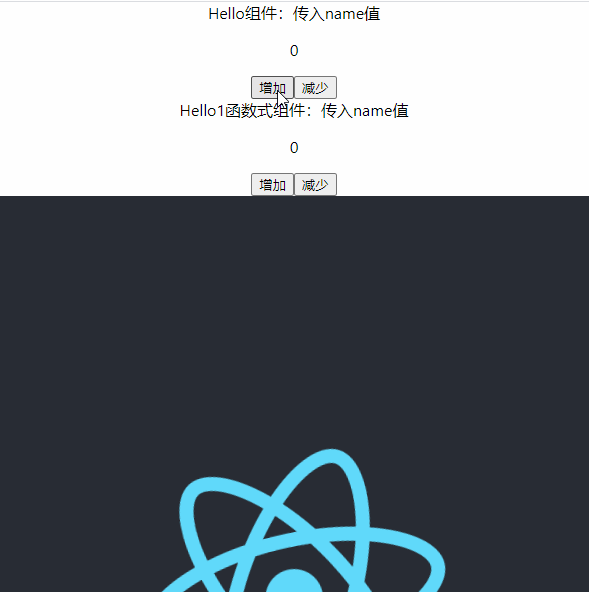
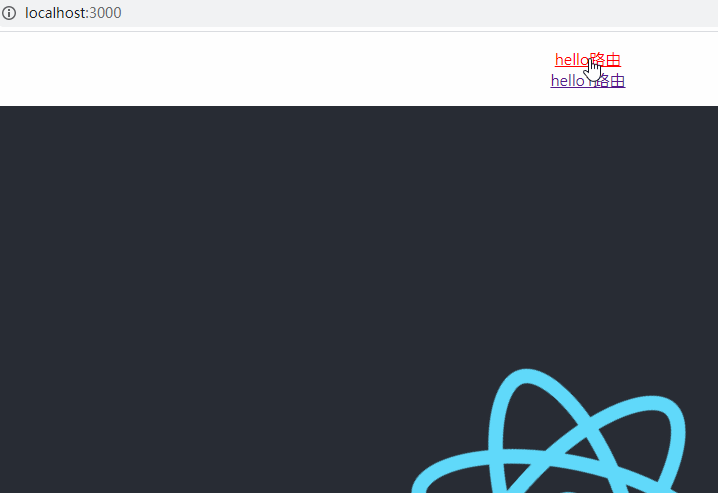

## ts-react
> typescript + react 项目搭建

### 搭建项目命令
```javascript
create-react-app ts-react --template typescript
或
create-react-app ts-react --scripts-version=react-scripts-ts
```

react项目详细：[https://github.com/ccyinghua/imooc-react-chat](https://github.com/ccyinghua/imooc-react-chat)

### 1、添加redux
```
cnpm install redux redux-thunk react-redux @types/react-redux --save
```

src/index.tsx
```javascript
import React from 'react';
import ReactDOM from 'react-dom';
import {createStore, applyMiddleware, compose} from "redux";
import thunk from "redux-thunk";
import { Provider } from "react-redux";
import './index.css';
import App from './App';
import reportWebVitals from './reportWebVitals';
import reducers from "./redux/reducer";

// 新建store
const store = createStore(reducers, compose(
  applyMiddleware(thunk),
  window.devToolsExtension ? window.devToolsExtension() : (f: any) => f
))

ReactDOM.render(
  <Provider store={store}>
    <React.StrictMode>
      <App />
    </React.StrictMode>
  </Provider>,
  document.getElementById('root')
);

// If you want to start measuring performance in your app, pass a function
// to log results (for example: reportWebVitals(console.log))
// or send to an analytics endpoint. Learn more: https://bit.ly/CRA-vitals
reportWebVitals();
```

src/redux/reducer.ts
```javascript
// 合并所有reducer
import { combineReducers } from "redux";
// import { count, CountState } from "./count/count.redux";

// export interface ReducerState {
//     count: CountState
// }

// export default combineReducers({ count });
export default combineReducers({});
```
`window.devToolsExtension`会报类型错误，根目录下建立typings.d.ts或者types/window.d.ts声明window。types目录下可以定义命名空间，声明一些公用的类型，组件可直接使用。要在tsconfig.json配置中
```javascript
...
"include": [
    "src",
    "types/*",
    "types/**/*",
    "typings.d.ts"
]
...
```

#### 使用redux:
redux/count/count.ts
```javascript
// 定义增加 state 类型常量
export const INCREMENT = "INCREMENT";
export type INCREMENT_TYPE = typeof INCREMENT;

// 定义减少 state 类型常量
export const DECREMENT = "DECREMENT";
export type DECREMENT_TYPE = typeof DECREMENT;
```

redux/count/count.redux.ts
```javascript
import { DECREMENT, DECREMENT_TYPE, INCREMENT, INCREMENT_TYPE } from "./count";

export interface CountState {
	count: number;
}

export interface CountAction {
	type: INCREMENT_TYPE | DECREMENT_TYPE;
}

const initState: CountState = {
	count: 0
};

// 这就是reducer处理函数，参数是state和新的action
export function count(state = initState, action: CountAction): CountState {
	switch (action.type) {
		case INCREMENT:
			return { ...state, count: state.count + 1 };
		case DECREMENT:
			return { ...state, count: state.count - 1 };
		default:
			return state;
	}
}

// 增加 state 次数的方法
export const increment = (): CountAction => ({
	type: INCREMENT
});

// 减少 state 次数的方法
export const decrement = (): CountAction => ({
	type: DECREMENT
});
```
src/redux/reducer.ts
```javascript
// 合并所有reducer
import { combineReducers } from "redux";
import { count, CountState } from "./count/count.redux";

export interface ReducerState {
    count: CountState
}

export default combineReducers({ count });
```
src/components/Hello.tsx
```javascript
import React, { Component } from "react";
// import { Dispatch } from "redux";
import { connect } from "react-redux";
import { CountState, increment, decrement } from "../redux/count/count.redux";
import { ReducerState } from "../redux/reducer";

interface Props {
	name: String;
	increment: () => void;
	decrement: () => void;
}

class Hello extends Component<Props & CountState> {
	render() {
		const { name, increment, decrement } = this.props;
		return (
			<div>
				<div>Hello组件：传入{name}</div>
				<p>{this.props.count}</p>
				<button onClick={increment}>增加</button>
				<button onClick={decrement}>减少</button>
			</div>
		);
	}
}

const mapStateToProps = (state: ReducerState) => state.count;

// 将对应action插入到组件的props中
// const mapDispatchToProps = (dispatch: Dispatch) => ({
// 	increment: () => dispatch(increment()),
// 	decrement: () => dispatch(decrement())
// });

export default connect(mapStateToProps, { increment, decrement })(Hello);
```
src/components/Hello1.tsx
```javascript
import React from "react";
import { Dispatch } from "redux";
import { connect } from "react-redux";
import { CountState, increment, decrement } from "../redux/count/count.redux";
import { ReducerState } from "../redux/reducer";

interface Props {
	name: String;
	increment: () => void;
	decrement: () => void;
}

const Hello1: React.FC<Props & CountState> = React.memo(props => {
	const { name, increment, decrement } = props;
	return (
		<div>
			<div>Hello1函数式组件：传入{name}</div>
			<p>{props.count}</p>
			<button onClick={increment}>增加</button>
			<button onClick={decrement}>减少</button>
		</div>
	);
});

const mapStateToProps = (state: ReducerState) => state.count;

// 将对应action插入到组件的props中
const mapDispatchToProps = (dispatch: Dispatch) => ({
	increment: () => dispatch(increment()),
	decrement: () => dispatch(decrement())
});

export default connect(mapStateToProps, mapDispatchToProps)(Hello1);
```
src/App.tsx引入组件
```javascript
import React from "react";
import logo from "./logo.svg";
import Hello from "./components/Hello";
import Hello1 from "./components/Hello1";
import "./App.css";

function App() {
	return (
		<div className="App">
			<Hello name="name值"></Hello>
			<Hello1 name="name值"></Hello1>
			<header className="App-header">
				
				<p>
					Edit<code>src/App.tsx</code> and save to reload.
				</p>
				<a className="App-link" href="https://reactjs.org" target="_blank" rel="noopener noreferrer">
					Learn React
				</a>
			</header>
		</div>
	);
}

export default App;
```
结果：

### 2、添加router
```javascript
cnpm install react-router-dom @types/react-router-dom --save
```
src/index.tsx
```javascript
import { BrowserRouter } from "react-router-dom";

...
ReactDOM.render(
  <Provider store={store}>
    <BrowserRouter>
      <React.StrictMode>
        <App />
      </React.StrictMode>
    </BrowserRouter>
  </Provider>,
  document.getElementById('root')
);
...
```
src/App.tsx
```javascript
import { Switch,Route, Link } from "react-router-dom";

<ul>
	<li><Link to="/hello">hello路由</Link></li>
	<li><Link to="/hello1">hello1路由</Link></li>
</ul>
<Switch>
	<Route path="/hello" component={Hello}></Route>
	<Route path="/hello1" component={Hello1}></Route>
</Switch>
```
结果：

### 3、添加antd
```javascript
cnpm install antd --save
```
src/index.tsx引入样式
```javascript
import 'antd/dist/antd.css';
```

```
npm run eject
```